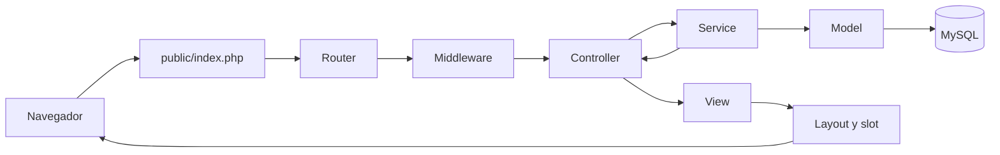
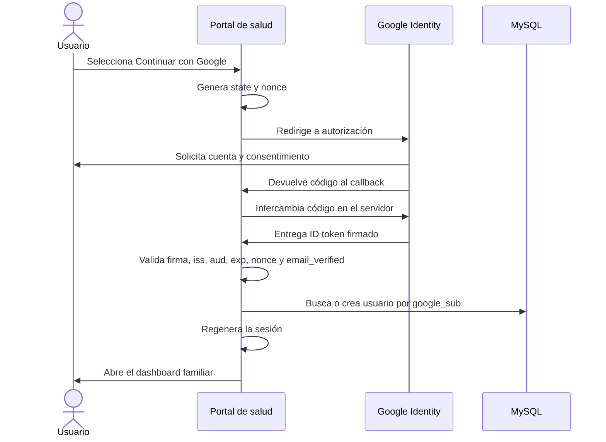

# Arquitectura y estructura: Portal Familiar de Salud

## 1. Enfoque

El sistema se desarrollará con PHP 8.2+, MySQL 8 y una arquitectura MVC modular inspirada en Laravel, pero sin requerir el framework completo.

Principios:

- Una sola entrada pública mediante `public/index.php`.
- Separación entre controladores, servicios, modelos y vistas.
- Vistas PHP con layouts, componentes y slots.
- Configuración mediante `.env`.
- Migraciones y seeders versionados.
- Composer y carga automática PSR-4.
- Acceso exclusivo con una cuenta Google mediante OpenID Connect.
- PDO, consultas preparadas y transacciones.
- `public/` como única carpeta expuesta por el servidor.

## 2. Tecnologías

| Componente | Tecnología |
|---|---|
| Backend | PHP 8.2 o superior |
| Base de datos | MySQL 8, InnoDB y `utf8mb4` |
| Arquitectura | MVC modular con capa de servicios |
| Dependencias | Composer y autoload PSR-4 |
| Identidad | Google Identity Services, OAuth 2.0 y OpenID Connect |
| Acceso a datos | PDO con consultas preparadas |
| Interfaz | HTML renderizado en servidor, CSS y JavaScript liviano |
| Servidor | Apache o Nginx |
| Pruebas | PHPUnit |

## 3. Estructura de carpetas

```text
portal-salud/
├── app/
│   ├── Core/
│   │   ├── Application.php
│   │   ├── Config.php
│   │   ├── Container.php
│   │   ├── Database.php
│   │   ├── Model.php
│   │   ├── Request.php
│   │   ├── Response.php
│   │   ├── Router.php
│   │   ├── Session.php
│   │   ├── Validator.php
│   │   └── View.php
│   ├── Http/
│   │   ├── Controllers/
│   │   │   ├── AuthController.php
│   │   │   ├── DashboardController.php
│   │   │   ├── FamiliaController.php
│   │   │   ├── PersonaController.php
│   │   │   ├── AtencionController.php
│   │   │   ├── MedicamentoController.php
│   │   │   ├── DocumentoController.php
│   │   │   └── MantenedorController.php
│   │   └── Middleware/
│   │       ├── Authenticate.php
│   │       ├── AuthorizeFamily.php
│   │       └── VerifyCsrfToken.php
│   ├── Models/
│   │   ├── Proceso.php
│   │   ├── Estado.php
│   │   ├── Tipo.php
│   │   ├── Familia.php
│   │   ├── Usuario.php
│   │   ├── Persona.php
│   │   ├── Atencion.php
│   │   ├── Medicamento.php
│   │   └── Documento.php
│   ├── Services/
│   │   ├── GoogleAuthService.php
│   │   ├── FamiliaService.php
│   │   ├── AtencionService.php
│   │   ├── MedicamentoService.php
│   │   └── DocumentoService.php
│   └── Support/
│       ├── Auth.php
│       ├── Csrf.php
│       └── helpers.php
├── bootstrap/
│   └── app.php
├── config/
│   ├── app.php
│   ├── auth.php
│   ├── database.php
│   └── filesystems.php
├── database/
│   ├── migrations/
│   └── seeders/
├── public/
│   ├── index.php
│   └── assets/
│       ├── css/
│       ├── js/
│       └── images/
├── resources/
│   └── views/
│       ├── layouts/
│       ├── components/
│       ├── auth/
│       ├── dashboard/
│       ├── familias/
│       ├── personas/
│       ├── atenciones/
│       ├── medicamentos/
│       ├── documentos/
│       └── mantenedores/
├── routes/
│   ├── web.php
│   └── auth.php
├── storage/
│   ├── documentos/
│   ├── logs/
│   └── cache/
├── tests/
│   ├── Feature/
│   └── Unit/
├── .env
├── .env.example
├── composer.json
├── phpunit.xml
└── README.md
```

## 4. Capas y responsabilidades

| Capa | Responsabilidad |
|---|---|
| Core | Enrutamiento, conexión, peticiones, respuestas, sesiones, vistas y validación |
| Middleware | Autenticación, CSRF y autorización por familia |
| Controllers | Recibir la petición y coordinar la respuesta |
| Services | Reglas de negocio y transacciones |
| Models | Consultas y persistencia de cada entidad |
| Views | Presentación HTML sin consultas directas a la base de datos |
| Config | Configuración obtenida desde el entorno |

Para el MVP no se utilizará una capa de repositorios. Los modelos cubrirán la persistencia y los servicios concentrarán las reglas de negocio.

## 5. Flujo de una petición



1. `public/index.php` carga Composer y `bootstrap/app.php`.
2. El router resuelve método, ruta y parámetros.
3. Los middleware validan sesión, CSRF y acceso familiar.
4. El controlador valida la entrada y llama al servicio.
5. El servicio ejecuta reglas de negocio y transacciones.
6. El modelo trabaja con MySQL mediante PDO.
7. La vista se renderiza dentro de un layout y genera la respuesta.

## 6. Layouts, componentes y slots

### Layouts

```text
resources/views/layouts/
├── app.php
├── guest.php
└── print.php
```

- `app.php`: portal autenticado con encabezado y navegación.
- `guest.php`: pantalla de acceso con el botón **Continuar con Google**.
- `print.php`: reportes sin navegación.

### Ejemplo de slot

```php
<?= $view->layout('layouts/app', [
    'title' => 'Ficha de la persona',
], function () use ($view, $persona) { ?>
    <h1><?= $view->escape($persona['nombre']) ?></h1>
<?php }) ?>
```

### Componentes

```text
resources/views/components/
├── alert.php
├── badge.php
├── button.php
├── card.php
├── empty-state.php
├── field-error.php
├── form-input.php
├── form-select.php
├── modal.php
├── page-header.php
├── table.php
└── timeline-item.php
```

Los componentes reciben propiedades y opcionalmente un slot. Todo contenido dinámico se escapa de forma predeterminada.

## 7. Módulos del MVP

| Módulo | Controlador | Servicio | Modelo principal | Vistas |
|---|---|---|---|---|
| Autenticación Google | AuthController | GoogleAuthService | Usuario | auth/ |
| Dashboard | DashboardController | — | Varios | dashboard/ |
| Familias | FamiliaController | FamiliaService | Familia | familias/ |
| Personas | PersonaController | FamiliaService | Persona | personas/ |
| Atenciones | AtencionController | AtencionService | Atencion | atenciones/ |
| Medicamentos | MedicamentoController | MedicamentoService | Medicamento | medicamentos/ |
| Documentos | DocumentoController | DocumentoService | Documento | documentos/ |
| Mantenedores | MantenedorController | — | Proceso, Estado y Tipo | mantenedores/ |

## 8. Rutas

Las rutas se separarán en públicas y autenticadas:

```php
// routes/auth.php
$router->get('/login', [AuthController::class, 'create']);
$router->get('/auth/google', [AuthController::class, 'redirectToGoogle']);
$router->get('/auth/google/callback', [AuthController::class, 'handleGoogleCallback']);
$router->post('/logout', [AuthController::class, 'destroy'])
    ->middleware(['auth', 'csrf']);

// routes/web.php
$router->get('/', [DashboardController::class, 'index'])
    ->middleware(['auth']);

$router->resource('/personas', PersonaController::class)
    ->middleware(['auth', 'family']);
```

| Método | Ruta | Acción |
|---|---|---|
| GET | `/personas` | Listar |
| GET | `/personas/create` | Formulario de creación |
| POST | `/personas` | Crear |
| GET | `/personas/{id}` | Consultar |
| GET | `/personas/{id}/edit` | Formulario de edición |
| PUT | `/personas/{id}` | Actualizar |
| DELETE | `/personas/{id}` | Eliminar |

La misma convención se aplicará a atenciones, medicamentos y documentos. Los formularios HTML utilizarán `_method` para simular `PUT` y `DELETE`.

## 9. Configuración MySQL

```text
APP_NAME="Portal Familiar de Salud"
APP_ENV=local
APP_DEBUG=true
APP_URL=http://localhost:8000

DB_HOST=127.0.0.1
DB_PORT=3306
DB_DATABASE=portal_salud
DB_USERNAME=root
DB_PASSWORD=

GOOGLE_CLIENT_ID=
GOOGLE_CLIENT_SECRET=
GOOGLE_REDIRECT_URI=http://localhost:8000/auth/google/callback
```

Reglas:

- InnoDB y `utf8mb4`.
- Claves foráneas e índices en todas las relaciones.
- Consultas preparadas mediante PDO.
- Transacciones en operaciones con varias tablas.
- Fechas técnicas almacenadas en UTC.
- Credenciales únicamente en `.env`.
- Esquema definido en `MODELO_DATOS_BASICO.md`.

## 10. Acceso con Google/Gmail

El sistema no tendrá registro con contraseña ni recuperación de contraseña. La pantalla de acceso mostrará únicamente **Continuar con Google**.



Implementación:

- Crear en Google Cloud un cliente OAuth de tipo **Web application**.
- Registrar exactamente las URI de redirección de desarrollo y producción.
- Solicitar solo los scopes `openid`, `email` y `profile`.
- Usar el flujo Authorization Code en el servidor mediante una biblioteca oficial o ampliamente probada para PHP.
- Generar y validar `state` para proteger el callback contra CSRF.
- Generar y validar `nonce` para vincular la respuesta con la solicitud de autenticación.
- Validar firma, emisor, audiencia, vencimiento y `email_verified` del ID token.
- Identificar al usuario por el claim `sub`, no por su correo.
- Crear automáticamente el usuario en el primer acceso o asociarlo a una invitación familiar pendiente.
- No guardar access tokens ni refresh tokens, porque el MVP solo requiere identidad y no consumirá Gmail, Drive ni Calendar.
- Mantener `GOOGLE_CLIENT_SECRET` únicamente en `.env` o en el gestor de secretos del servidor.
- Utilizar HTTPS en producción.

El acceso aceptará cuentas Gmail personales y cuentas Google Workspace. Si posteriormente se requiere limitar el ingreso a un dominio, se agregará una validación explícita del dominio alojado; no será parte del MVP.

## 11. Migraciones

```text
database/migrations/
├── 001_create_migrations_table.sql
├── 002_create_procesos_table.sql
├── 003_create_estados_table.sql
├── 004_create_tipos_table.sql
├── 005_create_familias_table.sql
├── 006_create_usuarios_table.sql
├── 007_create_familia_usuarios_table.sql
├── 008_create_personas_table.sql
├── 009_create_atenciones_table.sql
├── 010_create_medicamentos_table.sql
├── 011_create_medicamento_horarios_table.sql
├── 012_create_documentos_table.sql
└── 013_add_orden_to_tipos.sql
```

La tabla `migrations` registrará cada archivo aplicado. Comandos previstos:

```text
php console migrate
php console db:seed
php console migrate:fresh --seed
```

`migrate:fresh` estará limitado al entorno local porque elimina y reconstruye todas las tablas.

## 12. Seeders

```text
database/seeders/
├── DatabaseSeeder.php
├── ProcesosSeeder.php
├── EstadosSeeder.php
├── TiposSeeder.php
└── DemoSeeder.php
```

- Los seeders de procesos, estados y tipos se ejecutan en todos los entornos.
- `DemoSeeder` solo se ejecuta en desarrollo.
- Los seeders serán idempotentes y usarán códigos únicos para evitar duplicados.
- Ningún seeder de producción incluirá datos personales reales.

## 13. Archivos y almacenamiento

```text
storage/documentos/{familia_id}/{persona_id}/{nombre_aleatorio}
```

- Los documentos se almacenan fuera de `public/`.
- La descarga pasa siempre por el controlador.
- Se valida que el usuario pertenezca a la familia de la persona.
- Se controlan tamaño, extensión y MIME real.
- El nombre original se guarda en MySQL, pero no se utiliza como nombre físico.

## 14. Seguridad mínima

- Regeneración de sesión después del acceso.
- Validación completa de la respuesta OpenID Connect de Google.
- Cookies `HttpOnly`, `SameSite=Lax` y `Secure` en producción.
- Protección CSRF en formularios de escritura.
- Escape HTML predeterminado.
- Validación de entrada del lado servidor.
- Verificación de familia en cada registro solicitado.
- Mensajes públicos sin detalles técnicos.
- Logs sin contraseñas, notas clínicas ni archivos médicos.

## 15. Pruebas

```text
tests/
├── Feature/
│   ├── AuthTest.php
│   ├── FamilyAccessTest.php
│   ├── PersonaTest.php
│   ├── AtencionTest.php
│   ├── MedicamentoTest.php
│   └── DocumentoTest.php
└── Unit/
    ├── ValidatorTest.php
    └── EstadoTipoTest.php
```

Las pruebas funcionales cubrirán el flujo HTTP completo y el aislamiento de datos entre familias. Las pruebas unitarias cubrirán validación, estados y tipos por proceso.
