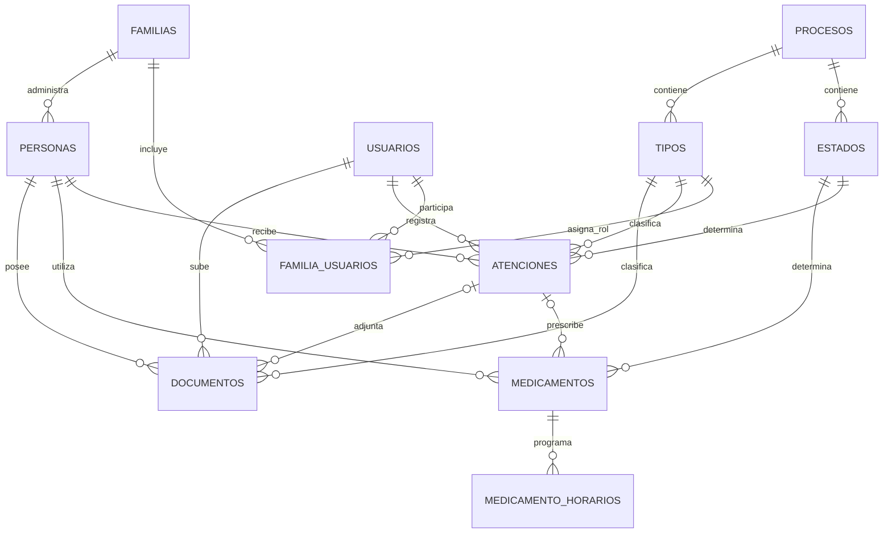

# Modelo de datos básico: Portal Familiar de Salud

## 1. Objetivo

Este modelo corresponde a una primera versión funcional del portal. Permite que varios familiares compartan la información médica de una o más personas sin incorporar todavía permisos avanzados, auditoría completa, alertas automáticas ni flujos complejos.

El modelo utiliza **11 tablas** y mantiene estados y tipos en tablas administrables, evitando que los usuarios escriban valores diferentes para el mismo concepto.

## 2. Diagrama entidad-relación

## 3. Mantenedores

### Tabla `procesos`

Agrupa los estados y tipos disponibles para cada parte del sistema.

| Campo | Tipo de dato | Obligatorio | Clave | Descripción |
|---|---|:---:|---|---|
| id | BIGINT UNSIGNED | Sí | PK | Identificador |
| codigo | VARCHAR(50) | Sí | UK | Código interno, por ejemplo `ATENCION` |
| nombre | VARCHAR(100) | Sí | — | Nombre visible |
| activo | BOOLEAN | Sí | — | Indica si puede utilizarse |
| created_at | DATETIME | Sí | — | Fecha de creación |
| updated_at | DATETIME | Sí | — | Última modificación |

### Tabla `estados`

| Campo | Tipo de dato | Obligatorio | Clave | Referencia | Descripción |
|---|---|:---:|---|---|---|
| id | BIGINT UNSIGNED | Sí | PK | — | Identificador |
| proceso_id | BIGINT UNSIGNED | Sí | FK | procesos.id | Proceso al que pertenece |
| codigo | VARCHAR(50) | Sí | UK compuesta | — | Código estable |
| nombre | VARCHAR(100) | Sí | UK compuesta | — | Nombre mostrado al usuario |
| orden | SMALLINT UNSIGNED | Sí | — | Orden de presentación |
| activo | BOOLEAN | Sí | — | Disponible para nuevos registros |
| created_at | DATETIME | Sí | — | Fecha de creación |
| updated_at | DATETIME | Sí | — | Última modificación |

Restricciones únicas: `(proceso_id, codigo)` y `(proceso_id, nombre)`.

### Tabla `tipos`

| Campo | Tipo de dato | Obligatorio | Clave | Referencia | Descripción |
|---|---|:---:|---|---|---|
| id | BIGINT UNSIGNED | Sí | PK | — | Identificador |
| proceso_id | BIGINT UNSIGNED | Sí | FK | procesos.id | Proceso al que pertenece |
| codigo | VARCHAR(50) | Sí | UK compuesta | — | Código estable |
| nombre | VARCHAR(100) | Sí | UK compuesta | — | Nombre mostrado al usuario |
| activo | BOOLEAN | Sí | — | Disponible para nuevos registros |
| created_at | DATETIME | Sí | — | Fecha de creación |
| updated_at | DATETIME | Sí | — | Última modificación |

Restricciones únicas: `(proceso_id, codigo)` y `(proceso_id, nombre)`.

## 4. Familia y usuarios

### Tabla `familias`

| Campo | Tipo de dato | Obligatorio | Clave | Descripción |
|---|---|:---:|---|---|
| id | BIGINT UNSIGNED | Sí | PK | Identificador |
| nombre | VARCHAR(150) | Sí | — | Nombre del grupo familiar |
| created_at | DATETIME | Sí | — | Fecha de creación |
| updated_at | DATETIME | Sí | — | Última modificación |

### Tabla `usuarios`

| Campo | Tipo de dato | Obligatorio | Clave | Descripción |
|---|---|:---:|---|---|
| id | BIGINT UNSIGNED | Sí | PK | Identificador |
| nombre | VARCHAR(150) | Sí | — | Nombre completo |
| email | VARCHAR(254) | Sí | UK | Correo de acceso |
| google_sub | VARCHAR(255) | Sí | UK | Identificador estable entregado por Google |
| avatar_url | VARCHAR(500) | No | — | Fotografía del perfil de Google |
| email_verificado_at | DATETIME | Sí | — | Fecha en que se confirmó el correo verificado por Google |
| ultimo_acceso_at | DATETIME | No | — | Último ingreso correcto al sistema |
| activo | BOOLEAN | Sí | — | Permite iniciar sesión |
| created_at | DATETIME | Sí | — | Fecha de creación |
| updated_at | DATETIME | Sí | — | Última modificación |

El acceso será exclusivamente mediante Google. No se almacenarán contraseñas, tokens de acceso ni tokens de actualización de Google. El correo puede cambiar; `google_sub` será la identidad estable utilizada para reconocer al usuario.

### Tabla `familia_usuarios`

Relaciona usuarios con familias. El rol se obtiene del mantenedor `tipos` asociado al proceso `MIEMBRO_FAMILIA`.

| Campo | Tipo de dato | Obligatorio | Clave | Referencia | Descripción |
|---|---|:---:|---|---|---|
| familia_id | BIGINT UNSIGNED | Sí | PK, FK | familias.id | Familia |
| usuario_id | BIGINT UNSIGNED | Sí | PK, FK | usuarios.id | Usuario |
| tipo_rol_id | BIGINT UNSIGNED | Sí | FK | tipos.id | Administrador o familiar |
| created_at | DATETIME | Sí | — | Fecha de incorporación |

PK compuesta: `(familia_id, usuario_id)`.

## 5. Personas

### Tabla `personas`

| Campo | Tipo de dato | Obligatorio | Clave | Referencia | Descripción |
|---|---|:---:|---|---|---|
| id | BIGINT UNSIGNED | Sí | PK | — | Identificador |
| familia_id | BIGINT UNSIGNED | Sí | FK | familias.id | Familia responsable |
| nombre | VARCHAR(150) | Sí | — | Nombre completo |
| identificacion | VARCHAR(30) | No | — | RUT u otra identificación |
| fecha_nacimiento | DATE | No | — | Fecha de nacimiento |
| grupo_sanguineo | VARCHAR(10) | No | — | Grupo sanguíneo |
| alergias | TEXT | No | — | Alergias conocidas |
| enfermedades_cronicas | TEXT | No | — | Condiciones relevantes |
| contacto_emergencia | VARCHAR(150) | No | — | Persona de contacto |
| telefono_emergencia | VARCHAR(30) | No | — | Teléfono de emergencia |
| observaciones | TEXT | No | — | Información general |
| created_at | DATETIME | Sí | — | Fecha de creación |
| updated_at | DATETIME | Sí | — | Última modificación |

Para el MVP, alergias y enfermedades se almacenan como texto descriptivo. Si posteriormente necesitan historial individual, se separarán en una tabla de antecedentes.

## 6. Atenciones

### Tabla `atenciones`

Una sola tabla representa horas médicas, visitas realizadas, terapias y exámenes. El mantenedor de tipos permite distinguirlas.

| Campo | Tipo de dato | Obligatorio | Clave | Referencia | Descripción |
|---|---|:---:|---|---|---|
| id | BIGINT UNSIGNED | Sí | PK | — | Identificador |
| persona_id | BIGINT UNSIGNED | Sí | FK | personas.id | Persona atendida |
| tipo_id | BIGINT UNSIGNED | Sí | FK | tipos.id | Consulta, terapia o examen |
| estado_id | BIGINT UNSIGNED | Sí | FK | estados.id | Programada, realizada o cancelada |
| registrado_por_usuario_id | BIGINT UNSIGNED | Sí | FK | usuarios.id | Familiar que registra |
| fecha_hora | DATETIME | Sí | — | Fecha y hora |
| profesional | VARCHAR(150) | No | — | Profesional o terapeuta |
| especialidad | VARCHAR(120) | No | — | Especialidad |
| centro_medico | VARCHAR(150) | No | — | Lugar de atención |
| motivo | TEXT | No | — | Motivo de la atención |
| diagnostico_resultado | TEXT | No | — | Diagnóstico o resultado informado |
| indicaciones | TEXT | No | — | Indicaciones recibidas |
| temas_abordados | TEXT | No | — | Contenido de terapia cuando corresponda |
| acuerdos | TEXT | No | — | Tareas o acuerdos posteriores |
| proxima_fecha | DATE | No | — | Próximo control o sesión sugerida |
| created_at | DATETIME | Sí | — | Fecha de creación |
| updated_at | DATETIME | Sí | — | Última modificación |

## 7. Medicamentos

### Tabla `medicamentos`

| Campo | Tipo de dato | Obligatorio | Clave | Referencia | Descripción |
|---|---|:---:|---|---|---|
| id | BIGINT UNSIGNED | Sí | PK | — | Identificador |
| persona_id | BIGINT UNSIGNED | Sí | FK | personas.id | Persona que lo utiliza |
| atencion_id | BIGINT UNSIGNED | No | FK | atenciones.id | Atención que lo originó |
| estado_id | BIGINT UNSIGNED | Sí | FK | estados.id | Activo, suspendido o finalizado |
| nombre | VARCHAR(150) | Sí | — | Nombre del medicamento |
| dosis | VARCHAR(100) | Sí | — | Dosis indicada |
| frecuencia | VARCHAR(150) | No | — | Descripción complementaria |
| fecha_inicio | DATE | Sí | — | Inicio del tratamiento |
| fecha_termino | DATE | No | — | Término esperado |
| indicaciones | TEXT | No | — | Forma de administración |
| created_at | DATETIME | Sí | — | Fecha de creación |
| updated_at | DATETIME | Sí | — | Última modificación |

### Tabla `medicamento_horarios`

| Campo | Tipo de dato | Obligatorio | Clave | Referencia | Descripción |
|---|---|:---:|---|---|---|
| id | BIGINT UNSIGNED | Sí | PK | — | Identificador |
| medicamento_id | BIGINT UNSIGNED | Sí | FK, UK compuesta | medicamentos.id | Medicamento |
| hora | TIME | Sí | UK compuesta | — | Hora de administración |
| created_at | DATETIME | Sí | — | Fecha de creación |

Restricción única: `(medicamento_id, hora)`.

## 8. Documentos

### Tabla `documentos`

Permite guardar órdenes, recetas, resultados e informes. Puede asociarse opcionalmente con la atención desde la cual se cargó.

| Campo | Tipo de dato | Obligatorio | Clave | Referencia | Descripción |
|---|---|:---:|---|---|---|
| id | BIGINT UNSIGNED | Sí | PK | — | Identificador |
| persona_id | BIGINT UNSIGNED | Sí | FK | personas.id | Persona propietaria |
| atencion_id | BIGINT UNSIGNED | No | FK | atenciones.id | Atención relacionada |
| tipo_id | BIGINT UNSIGNED | Sí | FK | tipos.id | Orden, receta, resultado o informe |
| subido_por_usuario_id | BIGINT UNSIGNED | Sí | FK | usuarios.id | Familiar que carga el archivo |
| nombre | VARCHAR(255) | Sí | — | Nombre visible |
| archivo_ruta | VARCHAR(500) | Sí | UK | Ubicación privada |
| mime_type | VARCHAR(100) | Sí | — | Tipo de archivo validado |
| fecha_documento | DATE | No | — | Fecha del documento |
| descripcion | TEXT | No | — | Información adicional |
| created_at | DATETIME | Sí | — | Fecha de creación |
| updated_at | DATETIME | Sí | — | Última modificación |

## 9. Datos iniciales de los mantenedores

| Proceso | Estados | Tipos |
|---|---|---|
| `MIEMBRO_FAMILIA` | No requiere | `administrador`, `familiar` |
| `ATENCION` | `programada`, `realizada`, `cancelada` | `consulta_medica`, `terapia`, `examen` |
| `MEDICAMENTO` | `activo`, `suspendido`, `finalizado` | No requiere |
| `DOCUMENTO` | No requiere | `orden_medica`, `receta`, `resultado_examen`, `informe`, `certificado`, `otro` |

## 10. Reglas básicas

1. Los formularios solo muestran estados y tipos activos del proceso correspondiente.
2. No se permite escribir estados, tipos ni roles manualmente.
3. Un estado o tipo utilizado no se elimina; se marca como inactivo.
4. Todos los datos de una persona deben pertenecer a su misma familia.
5. Solo miembros de la familia pueden consultar o modificar sus datos.
6. La fecha de término de un medicamento no puede ser anterior a su inicio.
7. Los documentos se almacenan fuera del directorio público.
8. Los valores clínicos escritos en texto corresponden a información real de la atención, no a catálogos.
9. Solo se aceptará un acceso de Google cuando el ID token sea válido, su audiencia corresponda al cliente configurado y el correo esté verificado.

## 11. Alcance excluido del MVP

Para mantener pequeña la primera versión, se posponen:

- Auditoría detallada de cada cambio.
- Permisos personalizados por acción.
- Transiciones configurables entre estados.
- Alertas automáticas y lectura individual.
- Catálogos separados de profesionales y centros médicos.
- Tablas clínicas distintas para consultas, terapias y exámenes.
- Recuperación de registros eliminados.
- Registro de cada toma de medicamentos.

Estas funciones pueden incorporarse posteriormente sin reemplazar las entidades principales del MVP.
