# Plan de desarrollo: Portal Familiar de Salud

## 1. Objetivo

Construir el MVP del Portal Familiar de Salud sobre la estructura PHP existente, utilizando MySQL y acceso exclusivo mediante una cuenta Google/Gmail.

El MVP permitirá:

- Iniciar y cerrar sesión con Google.
- Crear un grupo familiar.
- Asociar familiares al grupo.
- Registrar una o más personas cuidadas.
- Registrar consultas médicas, terapias y exámenes.
- Mantener medicamentos y horarios.
- Cargar documentos médicos privados.
- Administrar procesos, estados y tipos.
- Consultar un panel e historia básica por persona.

## 2. Documentos de referencia

- `PROPUESTA_PORTAL_SALUD_FAMILIAR.md`: alcance funcional.
- `MODELO_DATOS_BASICO.md`: tablas, campos y relaciones del MVP.
- `ARQUITECTURA_Y_ESTRUCTURA.md`: arquitectura PHP y estructura de carpetas.

Si aparece una diferencia entre documentos, el orden de prioridad será:

1. `MODELO_DATOS_BASICO.md` para la base de datos.
2. `ARQUITECTURA_Y_ESTRUCTURA.md` para la organización técnica.
3. `PROPUESTA_PORTAL_SALUD_FAMILIAR.md` para el objetivo funcional.

## Lista de verificación del desarrollo

### 1. Entorno

- [x] Confirmar PHP 8.2 o superior y extensiones necesarias.
- [x] Instalar dependencias con Composer.
- [x] Crear y completar `.env`.
- [x] Implementar la carga de variables de entorno.
- [x] Configurar `public/` como raíz web.
- [x] Habilitar escritura en las carpetas de `storage/`.
- [x] Comprobar el autoload PSR-4.
- [x] Mostrar una respuesta inicial sin errores.

### 2. Base de datos y migraciones

- [x] Crear la base MySQL `portal_salud` con `utf8mb4`.
- [ ] Crear un usuario MySQL exclusivo para la aplicación.
- [x] Implementar la conexión PDO.
- [x] Crear el ejecutable `console`.
- [x] Implementar `migrate`.
- [x] Implementar `migrate:status`.
- [x] Implementar `migrate:fresh --seed` protegido por entorno.
- [x] Crear la migración de `migrations`.
- [x] Crear las migraciones de procesos, estados y tipos.
- [x] Crear las migraciones de familias y usuarios.
- [x] Crear la migración de personas.
- [x] Crear la migración de atenciones.
- [x] Crear las migraciones de medicamentos y horarios.
- [x] Crear la migración de documentos.
- [x] Ejecutar todas las migraciones desde una base vacía.
- [x] Verificar PK, FK, índices, restricciones únicas y reglas de eliminación.

### 3. Seeders

- [x] Crear `DatabaseSeeder`.
- [x] Crear `ProcesosSeeder`.
- [x] Crear `EstadosSeeder`.
- [x] Crear `TiposSeeder`.
- [x] Crear `DemoSeeder` solo para desarrollo.
- [x] Implementar `db:seed`.
- [x] Verificar que los seeders sean idempotentes.
- [x] Reconstruir localmente con `migrate:fresh --seed`.

### 4. Núcleo PHP

- [x] Completar Router con GET, POST, PUT y DELETE.
- [x] Resolver parámetros dinámicos de rutas.
- [x] Implementar grupos de middleware.
- [x] Completar Request y carga de archivos.
- [x] Completar Response, redirecciones y descargas.
- [x] Implementar layouts y slots en View.
- [x] Implementar componentes reutilizables.
- [x] Implementar mensajes flash y errores.
- [x] Completar sesiones seguras.
- [x] Implementar tokens CSRF.
- [x] Completar Validator y reglas iniciales.
- [x] Implementar manejo de excepciones y logs.

### 5. Acceso Google/Gmail

- [x] Crear proyecto en Google Cloud.
- [x] Configurar pantalla de consentimiento.
- [x] Crear cliente OAuth para aplicación web.
- [x] Registrar callback local.
- [ ] Registrar callback HTTPS productivo cuando exista el dominio.
- [x] Completar variables Google en `.env`.
- [x] Crear pantalla con **Continuar con Google**.
- [x] Implementar generación de `state` y `nonce`.
- [x] Implementar redirección hacia Google.
- [x] Implementar callback y canje del código.
- [x] Validar firma, emisor, audiencia, vencimiento y correo verificado.
- [x] Crear o actualizar el usuario mediante `google_sub`.
- [x] Regenerar la sesión después del acceso.
- [x] Implementar cierre de sesión.
- [x] Probar callbacks manipulados y usuarios inactivos.

### 6. Familias y autorización

- [x] Crear familia durante el primer acceso.
- [x] Asociar al creador como administrador.
- [x] Implementar selección de familia activa.
- [x] Asociar familiares mediante cuenta Google.
- [x] Implementar middleware de autenticación.
- [x] Implementar middleware de pertenencia familiar.
- [x] Verificar aislamiento de datos entre familias.

### 7. Mantenedores

- [x] Listar procesos.
- [x] Filtrar estados y tipos por proceso.
- [x] Crear y editar estados.
- [x] Crear y editar tipos.
- [x] Activar, desactivar y ordenar valores.
- [x] Impedir códigos y nombres duplicados.
- [x] Impedir eliminar valores utilizados.
- [x] Restringir el mantenedor al administrador.

### 8. Personas

- [x] Crear listado familiar de personas.
- [x] Crear formulario de registro.
- [x] Implementar consulta de ficha.
- [x] Implementar edición.
- [x] Validar identificación y fecha de nacimiento.
- [x] Mostrar resumen de atenciones y medicamentos.
- [x] Verificar acceso únicamente desde la familia autorizada.

### 9. Atenciones

- [x] Crear listado y filtros.
- [x] Registrar consultas médicas.
- [x] Registrar terapias.
- [x] Registrar exámenes.
- [x] Seleccionar tipo y estado desde mantenedores.
- [x] Registrar diagnóstico, resultados e indicaciones.
- [x] Registrar temas de terapia y acuerdos.
- [x] Mostrar línea de tiempo por persona.
- [x] Validar fechas, proceso y pertenencia familiar.

### 10. Medicamentos

- [x] Crear medicamento desde una atención.
- [x] Crear medicamento directamente desde la ficha.
- [x] Registrar dosis, frecuencia y período.
- [x] Agregar varios horarios diarios.
- [x] Evitar horarios duplicados.
- [x] Cambiar estado del medicamento.
- [x] Mostrar tratamientos activos.
- [x] Validar fechas y estado del proceso correcto.

### 11. Documentos

- [x] Crear formulario de carga.
- [x] Guardar archivos fuera de `public/`.
- [x] Generar nombres físicos aleatorios.
- [x] Guardar metadatos en MySQL.
- [x] Validar tamaño, extensión y MIME real.
- [x] Implementar descarga autenticada.
- [x] Verificar pertenencia familiar antes de descargar.
- [x] Implementar eliminación controlada.
- [x] Probar archivos permitidos y rechazados.

### 12. Dashboard e interfaz

- [x] Crear layout autenticado.
- [x] Crear navegación adaptable a móvil.
- [x] Crear componentes de formularios.
- [x] Crear cards, tablas, alertas y badges.
- [x] Mostrar selector de persona.
- [x] Mostrar próximas atenciones.
- [x] Mostrar medicamentos activos.
- [x] Mostrar documentos recientes.
- [x] Agregar accesos rápidos.
- [x] Verificar navegación en teléfono y computador.

### 12.1 Persona activa global

- [x] Guardar la persona activa en la sesión.
- [x] Mostrar un único selector en el encabezado.
- [x] Validar que la persona pertenezca a la familia activa.
- [x] Limpiar la selección al cambiar de familia.
- [x] Seleccionar automáticamente cuando exista una sola persona.
- [x] Filtrar dashboard, atenciones, medicamentos y documentos por la persona activa.
- [x] Quitar el selector de persona de filtros y formularios clínicos.
- [x] Asociar nuevos registros desde el servidor, ignorando IDs manipulados.
- [x] Filtrar relaciones de atenciones y medicamentos por la persona activa.
- [x] Convertir en activa la persona cuya ficha se abre.
- [x] Verificar el cambio global en navegación móvil.

### 13. Pruebas y seguridad

- [x] Configurar PHPUnit.
- [x] Crear pruebas unitarias de validación.
- [x] Crear pruebas de estados y tipos.
- [x] Probar acceso y cierre de sesión Google.
- [x] Probar aislamiento entre familias.
- [x] Probar personas.
- [x] Probar atenciones.
- [x] Probar medicamentos.
- [x] Probar carga y descarga de documentos.
- [x] Revisar inyección SQL.
- [x] Revisar XSS.
- [x] Revisar CSRF.
- [x] Revisar manipulación de identificadores.
- [x] Revisar seguridad de sesiones.
- [x] Revisar exposición de configuración y logs.

### 14. Despliegue

- [x] Crear configuración de producción.
- [x] Desactivar debug.
- [ ] Configurar HTTPS.
- [ ] Registrar callback HTTPS en Google Cloud.
- [ ] Crear usuario MySQL con permisos mínimos.
- [ ] Instalar dependencias optimizadas sin paquetes de desarrollo.
- [ ] Ejecutar migraciones y seeders de catálogos.
- [ ] Configurar respaldos de MySQL y documentos.
- [ ] Probar restauración desde respaldo.
- [x] Configurar rotación de logs.
- [x] Documentar instalación y actualización.
- [ ] Ejecutar la lista completa de aceptación del MVP.

## 3. Orden de implementación

```mermaid
flowchart LR
    A[Entorno] --> B[Base de datos]
    B --> C[Núcleo PHP]
    C --> D[Acceso Google]
    D --> E[Familias]
    E --> F[Personas]
    F --> G[Mantenedores]
    G --> H[Atenciones]
    H --> I[Medicamentos]
    I --> J[Documentos]
    J --> K[Dashboard]
    K --> L[Seguridad y pruebas]
```



## 4. Etapa 1: preparar el entorno

### Tareas

- Confirmar PHP 8.2 o superior con extensiones PDO MySQL, OpenSSL, Mbstring, JSON y Fileinfo.
- Instalar dependencias mediante Composer.
- Crear `.env` desde `.env.example`.
- Implementar carga segura de variables de entorno.
- Configurar la zona horaria `America/Santiago` para presentación.
- Configurar `public/` como raíz del servidor web.
- Confirmar permisos de escritura en `storage/cache`, `storage/logs` y `storage/documentos`.
- Mantener `.env`, `vendor/` y archivos médicos fuera del repositorio.

### Dependencias iniciales

```text
composer install
composer dump-autoload
```

### Entregable

La aplicación carga `public/index.php`, lee la configuración y muestra una pantalla inicial sin errores.

### Criterios de aceptación

- No existen credenciales dentro del código.
- Composer resuelve las clases `App\` mediante PSR-4.
- El modo debug depende de `APP_ENV` y `APP_DEBUG`.
- Una excepción se registra en logs sin mostrar datos sensibles en producción.

## 5. Etapa 2: crear la base de datos y migraciones

### 5.1 Crear la base MySQL

Crear una base vacía:

```sql
CREATE DATABASE portal_salud
  CHARACTER SET utf8mb4
  COLLATE utf8mb4_unicode_ci;
```

En producción se utilizará un usuario exclusivo con permisos únicamente sobre esta base. No se utilizará `root`.

### 5.2 Implementar la conexión

- Construir el DSN desde `config/database.php`.
- Crear una sola conexión PDO por petición.
- Activar excepciones, consultas preparadas reales y retorno asociativo.
- Ejecutar `SET time_zone = '+00:00'` cuando el servidor MySQL lo permita.
- No incluir contraseñas en mensajes de error o logs.

### 5.3 Crear el ejecutor de migraciones

Crear:

```text
console
app/Console/Migrator.php
app/Console/Seeder.php
```

Comandos requeridos:

```text
php console migrate
php console migrate:status
php console db:seed
php console migrate:fresh --seed
```

`migrate:fresh` debe negarse a ejecutar cuando `APP_ENV=production`.

### 5.4 Crear migraciones

Orden requerido:

```text
database/migrations/
├── 001_create_migrations_table.sql
├── 002_create_procesos_table.sql
├── 003_create_estados_table.sql
├── 004_create_tipos_table.sql
├── 005_create_familias_table.sql
├── 006_create_usuarios_table.sql
├── 007_create_familia_usuarios_table.sql
├── 008_create_personas_table.sql
├── 009_create_atenciones_table.sql
├── 010_create_medicamentos_table.sql
├── 011_create_medicamento_horarios_table.sql
├── 012_create_documentos_table.sql
└── 013_add_orden_to_tipos.sql
```

Cada migración debe:

- Utilizar InnoDB y `utf8mb4`.
- Definir PK, FK, índices y restricciones únicas del modelo.
- Respetar nulabilidad y tipos documentados.
- Definir explícitamente el comportamiento `ON DELETE` y `ON UPDATE`.
- Ejecutarse dentro de una transacción cuando MySQL lo permita.
- Registrar su nombre en la tabla `migrations` solamente después de completarse.

### Política inicial de eliminación

- No habilitar eliminación física de personas con datos clínicos.
- Usar `RESTRICT` para impedir eliminar familias, personas o usuarios referenciados.
- Usar `CASCADE` únicamente en tablas dependientes sin significado independiente, como `medicamento_horarios`.
- Los documentos se eliminan primero en la aplicación y luego en almacenamiento, nunca mediante una cascada SQL.

### Entregable

Base `portal_salud` creada con las 11 tablas funcionales y la tabla técnica `migrations`.

### Criterios de aceptación

- Una base vacía puede migrarse completamente.
- Ejecutar nuevamente `migrate` no duplica ni modifica tablas aplicadas.
- Las FK rechazan relaciones inválidas.
- `migrate:status` diferencia migraciones aplicadas y pendientes.
- `migrate:fresh --seed` reconstruye únicamente una base local.

## 6. Etapa 3: crear seeders

### Archivos

```text
database/seeders/
├── DatabaseSeeder.php
├── ProcesosSeeder.php
├── EstadosSeeder.php
├── TiposSeeder.php
└── DemoSeeder.php
```

### Datos iniciales

#### Procesos

- `MIEMBRO_FAMILIA`
- `ATENCION`
- `MEDICAMENTO`
- `DOCUMENTO`

#### Estados

- Atención: programada, realizada y cancelada.
- Medicamento: activo, suspendido y finalizado.

#### Tipos

- Rol familiar: administrador y familiar.
- Atención: consulta médica, terapia y examen.
- Documento: orden médica, receta, resultado, informe, certificado y otro.

### Reglas

- Utilizar códigos estables en mayúsculas y nombres visibles en español.
- Buscar por código antes de insertar.
- Actualizar el nombre si cambió, sin duplicar el registro.
- Ejecutar `DemoSeeder` solamente en desarrollo.
- No incluir información médica real.

### Entregable

Mantenedores mínimos disponibles después de ejecutar `php console db:seed`.

### Criterios de aceptación

- Dos ejecuciones consecutivas producen la misma cantidad de filas.
- Cada estado y tipo está asociado al proceso correcto.
- No existen valores libres duplicados por diferencias de mayúsculas o tildes.

## 7. Etapa 4: completar el núcleo PHP

### Router

- Registrar rutas GET, POST, PUT y DELETE.
- Resolver parámetros como `/personas/{id}`.
- Implementar grupos de middleware.
- Generar respuesta 404 cuando no exista la ruta.
- Admitir `_method` para formularios HTML.

### Request y Response

- Acceso controlado a query, formulario, JSON y archivos.
- Normalización básica de cadenas sin modificar notas clínicas.
- Respuestas HTML, redirecciones y descarga privada.
- Códigos HTTP correctos.

### View

- Renderizar vistas y layouts.
- Inyectar el contenido de la página en `$slot`.
- Renderizar componentes con propiedades y slot opcional.
- Escapar HTML de manera predeterminada.
- Permitir compartir mensajes flash y errores de validación.

### Session y CSRF

- Iniciar sesión con parámetros seguros.
- Regenerar el identificador después del acceso.
- Implementar flash data.
- Generar y validar token CSRF.
- Invalidar completamente la sesión al cerrar sesión.

### Validator

Reglas iniciales:

- `required`
- `string`
- `email`
- `date`
- `datetime`
- `integer`
- `in`
- `exists`
- `maxLength`
- validación de archivos

### Entregable

Núcleo capaz de ejecutar rutas reales, middleware, controladores, vistas, sesiones y validaciones.

## 8. Etapa 5: implementar acceso con Google/Gmail

### Configuración externa

- Crear un proyecto en Google Cloud.
- Configurar la pantalla de consentimiento OAuth.
- Crear credenciales OAuth para aplicación web.
- Registrar las URI exactas de callback local y producción.
- Agregar `GOOGLE_CLIENT_ID`, `GOOGLE_CLIENT_SECRET` y `GOOGLE_REDIRECT_URI` al entorno.

### Flujo

1. Mostrar el botón **Continuar con Google**.
2. Generar `state` y `nonce` y guardarlos en la sesión.
3. Redirigir a Google solicitando `openid`, `email` y `profile`.
4. Recibir el código en `/auth/google/callback`.
5. Validar `state` antes de intercambiar el código.
6. Validar firma, emisor, audiencia, vencimiento, nonce y `email_verified` del ID token.
7. Buscar al usuario por `google_sub`.
8. Crear el usuario en el primer acceso cuando corresponda.
9. Regenerar la sesión y guardar únicamente el ID interno del usuario.
10. Redirigir al dashboard o a la creación de familia.

### Restricciones

- No guardar access tokens ni refresh tokens.
- No solicitar acceso a Gmail, Drive o Calendar.
- No usar el correo como identificador permanente.
- No permitir acceso si el usuario está inactivo.
- Rechazar callbacks con estado, nonce o token inválidos.

### Entregable

Acceso y cierre de sesión funcionando con cuentas Gmail y Google Workspace.

### Criterios de aceptación

- Un usuario nuevo se registra una sola vez.
- Un usuario recurrente conserva su identidad aunque Google actualice su nombre o avatar.
- No existe formulario de contraseña local.
- Un callback manipulado no crea una sesión.

## 9. Etapa 6: familias y autorización

### Funciones

- Crear una familia al ingresar por primera vez.
- Asociar al creador como administrador.
- Mostrar la familia activa en la sesión.
- Asociar otro usuario Google mediante su correo verificado.
- Permitir roles administrador y familiar.
- Impedir acceso a familias ajenas.

### Middleware

- `Authenticate`: requiere usuario autenticado.
- `AuthorizeFamily`: verifica que el usuario pertenezca a la familia activa.
- `VerifyCsrfToken`: protege operaciones de escritura.

### Entregable

Usuarios autenticados trabajan únicamente dentro de una familia autorizada.

### Criterios de aceptación

- Un usuario no puede consultar registros cambiando un ID en la URL.
- El administrador puede asociar familiares.
- No se puede duplicar la misma pareja familia-usuario.

## 10. Etapa 7: mantenedores

### Funciones

- Listar procesos.
- Listar estados y tipos filtrados por proceso.
- Crear, editar, ordenar, activar y desactivar valores.
- Impedir códigos y nombres duplicados dentro de un proceso.
- Impedir eliminar valores utilizados.
- Mostrar solo valores activos en los formularios operacionales.

### Restricción de acceso

En el MVP, solamente el administrador familiar podrá acceder al módulo. Los procesos y códigos base no podrán eliminarse.

### Entregable

Mantenedor funcional para estados y tipos sin permitir valores libres en atenciones, medicamentos o documentos.

## 11. Etapa 8: personas

### Funciones

- Listar personas de la familia.
- Crear, consultar y editar una ficha.
- Registrar identificación, nacimiento, grupo sanguíneo, alergias, enfermedades, contacto de emergencia y observaciones.
- Mostrar resumen con próximas atenciones y medicamentos activos.

### Validaciones

- Nombre obligatorio.
- Identificación opcional, pero sin duplicados dentro de la familia.
- Fecha de nacimiento no futura.
- Todos los accesos filtrados por familia.

### Entregable

CRUD de personas y ficha individual.

## 12. Etapa 9: atenciones

### Funciones

- Registrar consulta médica, terapia o examen.
- Seleccionar tipo y estado desde mantenedores.
- Registrar fecha, profesional, especialidad, centro, motivo, resultado, indicaciones, temas abordados, acuerdos y próxima fecha.
- Filtrar por persona, tipo, estado y período.
- Mostrar atenciones en una línea de tiempo.

### Validaciones

- Persona, tipo, estado, fecha y usuario registrador obligatorios.
- Tipo y estado activos y pertenecientes al proceso `ATENCION`.
- Persona perteneciente a la familia activa.
- Próxima fecha no anterior a la fecha de atención, salvo corrección explícita autorizada.

### Entregable

Agenda e historia básica de atenciones por persona.

## 13. Etapa 10: medicamentos y horarios

### Funciones

- Crear medicamentos desde una atención o directamente desde la ficha.
- Registrar nombre, dosis, frecuencia, fechas e indicaciones.
- Agregar uno o varios horarios diarios.
- Cambiar estado a activo, suspendido o finalizado.
- Mostrar medicamentos activos en la ficha y dashboard.

### Validaciones

- Nombre, dosis, fecha de inicio y estado obligatorios.
- Estado perteneciente al proceso `MEDICAMENTO`.
- Fecha de término igual o posterior a la fecha de inicio.
- No duplicar una misma hora para el medicamento.

### Entregable

Gestión de medicamentos y horarios sin registrar cada toma.

## 14. Etapa 11: documentos privados

### Funciones

- Subir un documento desde la ficha o una atención.
- Asociar automáticamente el documento cuando la carga se inicia desde una atención; en los demás casos dejar la relación vacía.
- Registrar tipo, nombre, MIME, fecha y descripción.
- Guardar el archivo en una ruta privada y con nombre aleatorio.
- Descargar mediante un controlador autenticado.
- Eliminar de forma controlada el registro y archivo.

### Seguridad

- Validar tamaño máximo configurado.
- Validar extensión y MIME real mediante Fileinfo.
- Permitir inicialmente PDF, JPG, PNG y WEBP.
- Rechazar ejecutables, archivos PHP y nombres peligrosos.
- Verificar familia antes de cada descarga.
- Enviar `Content-Disposition` y `X-Content-Type-Options: nosniff`.

### Entregable

Órdenes, recetas, resultados e informes almacenados fuera de `public/`.

## 15. Etapa 12: dashboard e interfaz

### Dashboard

- Selector de persona.
- Próximas atenciones.
- Medicamentos activos.
- Documentos recientes.
- Accesos rápidos para registrar atención, medicamento o documento.

### Componentes mínimos

- Layout autenticado y layout de acceso.
- Encabezado y navegación adaptable a móvil.
- Card, botón, alerta, badge, tabla y estado vacío.
- Input, select, textarea y mensajes de validación.
- Elemento de línea de tiempo.

### Reglas de interfaz

- Formularios con etiquetas y mensajes claros.
- Selectores por nombre, nunca ingreso manual de IDs.
- Confirmación antes de eliminar.
- Conservación de valores cuando falle una validación.
- Navegación utilizable desde teléfono.

### Entregable

Interfaz coherente para completar los flujos principales del MVP.

## 16. Etapa 13: pruebas y endurecimiento

### Pruebas unitarias

- Validación de campos.
- Obtención de estados y tipos por proceso.
- Reglas de fechas de medicamentos.
- Generación y validación CSRF.

### Pruebas funcionales

- Acceso Google correcto y callback inválido.
- Cierre de sesión.
- Creación y aislamiento de familias.
- CRUD de personas.
- Registro y filtros de atenciones.
- Medicamentos con varios horarios.
- Carga, descarga autorizada y rechazo de archivos.
- Intentos de acceso a datos de otra familia.

### Revisión de seguridad

- Inyección SQL.
- XSS almacenado y reflejado.
- CSRF.
- Manipulación de IDs.
- Fijación de sesión.
- Carga de archivos maliciosos.
- Exposición de configuración y logs.

### Entregable

Suite automatizada aprobada y lista de verificación manual completada.

## 17. Etapa 14: preparación de despliegue

### Tareas

- Crear configuración de producción con `APP_DEBUG=false`.
- Instalar dependencias con `composer install --no-dev --optimize-autoloader`.
- Configurar HTTPS obligatorio.
- Registrar callback HTTPS en Google Cloud.
- Crear usuario MySQL de producción con permisos mínimos.
- Ejecutar migraciones y seeders de catálogos.
- Configurar respaldo diario de MySQL y documentos.
- Probar recuperación desde un respaldo.
- Configurar rotación de logs.
- Documentar despliegue y actualización.

### Entregable

Versión instalable en producción con respaldo y procedimiento de recuperación.

## 18. Hitos recomendados

| Hito | Contenido | Resultado demostrable |
|---|---|---|
| 1. Plataforma | Entorno, MySQL, migraciones, seeders y núcleo | Base creada y aplicación navegable |
| 2. Acceso | Google, sesiones, familias y autorización | Familia entra con Gmail de forma segura |
| 3. Salud básica | Personas y atenciones | Historia básica consultable |
| 4. Tratamientos | Medicamentos y horarios | Tratamientos activos visibles |
| 5. Evidencia | Documentos privados | Recetas y resultados protegidos |
| 6. Cierre MVP | Dashboard, pruebas y despliegue | MVP estable para uso familiar |

## 19. Definición de terminado

Una funcionalidad se considera terminada solamente cuando:

- Cumple los criterios funcionales definidos.
- Valida entrada y autorización del lado servidor.
- Utiliza estados y tipos del proceso correcto.
- Incluye migración o seeder cuando modifica datos estructurales.
- Tiene pruebas proporcionales al riesgo.
- No expone información clínica en logs o mensajes de error.
- Funciona en computador y teléfono.
- Su documentación relevante está actualizada.

## 20. Primer bloque de trabajo

El desarrollo debe comenzar con este orden exacto:

1. Completar carga de `.env` y configuración.
2. Implementar la conexión PDO a MySQL.
3. Implementar el comando `console` y el ejecutor de migraciones.
4. Crear las migraciones del modelo, incluyendo la tabla técnica `migrations` y la evolución de catálogos.
5. Crear y ejecutar seeders de procesos, estados y tipos.
6. Verificar reconstrucción completa con `migrate:fresh --seed` en local.
7. Continuar con router, sesiones, vistas y acceso Google.

No se debe comenzar el CRUD clínico antes de que las migraciones, seeders, aislamiento familiar y acceso estén funcionando.

## 21. Etapa 15: calendario de citas en el dashboard

### Objetivo

Mostrar al ingresar un calendario mensual con las atenciones de la persona activa. Cada cita debe identificarse visualmente mediante el color configurado para su estado.

### Experiencia de uso

- [x] Mostrar el calendario como contenido principal del dashboard.
- [x] Utilizar inicialmente una vista mensual.
- [x] Incorporar navegación al mes anterior, mes siguiente y al día actual.
- [x] Mostrar en cada cita la hora, el tipo de atención y el profesional cuando esté registrado.
- [x] Abrir el detalle de la atención al seleccionar una cita.
- [x] Permitir iniciar una nueva atención al seleccionar un día vacío, dejando la fecha precargada.
- [x] Actualizar el calendario cuando se cambie la persona activa en la cabecera.
- [x] Mostrar una leyenda con los estados y sus colores.
- [x] Mantener debajo del calendario los tratamientos activos y documentos recientes.
- [x] Utilizar una agenda diaria o lista cronológica en pantallas pequeñas.

### Estados y colores mantenibles

El color no debe quedar escrito directamente en el calendario. Debe formar parte del mantenedor de estados para que cada estado del proceso pueda administrarse sin modificar código.

| Campo | Tipo | Obligatorio | Regla |
|---|---|---:|---|
| `color` | `CHAR(7)` | Sí | Color hexadecimal en formato `#RRGGBB` |

Configuración inicial recomendada para el proceso Atención:

| Estado | Color inicial |
|---|---|
| Programada | Azul `#3478C8` |
| Realizada | Verde `#2F806B` |
| Cancelada | Rojo `#C64B4B` |

### Base de datos y mantenedores

- [x] Crear una nueva migración para agregar `color` a la tabla `estados`.
- [x] Definir un color válido para los estados existentes mediante migración o seeder.
- [x] Agregar el selector visual de color al formulario de estados.
- [x] Validar en el servidor el formato hexadecimal recibido.
- [x] Mostrar una muestra del color en el listado del mantenedor.
- [x] Mantener la relación existente entre estado y proceso.

### Consulta y seguridad

- [x] Incorporar una consulta de atenciones por fecha inicial y fecha final.
- [x] Limitar los resultados a la familia activa.
- [x] Limitar los resultados a la persona activa.
- [x] Incluir tipo, estado, color, fecha, hora y profesional en los datos del calendario.
- [x] Convertir correctamente las fechas entre UTC y `America/Santiago`.
- [x] Evitar que la manipulación de IDs permita consultar citas de otra persona o familia.
- [x] Definir un límite seguro para el rango de fechas consultado.

### Interfaz

- [x] Construir la primera versión con PHP, HTML, CSS y JavaScript del proyecto, sin agregar dependencias externas.
- [x] Diferenciar las citas por el color del estado y no solamente por texto.
- [x] Mantener texto o etiqueta del estado para accesibilidad y usuarios con dificultad para distinguir colores.
- [x] Mostrar claramente el día actual.
- [x] Mostrar un estado vacío cuando el mes no tenga citas.
- [x] Evitar desplazamiento horizontal en computador, tablet y teléfono.

### Pruebas y verificación

- [x] Probar un mes con citas de varios estados.
- [x] Probar meses sin citas.
- [x] Probar el cambio de persona activa.
- [x] Probar los límites entre meses y años.
- [x] Probar la zona horaria y citas cercanas a medianoche.
- [x] Probar que una familia no pueda consultar citas de otra familia.
- [x] Probar el calendario en escritorio y móvil.
- [x] Ejecutar la suite automatizada completa.

### Entregable

Dashboard con calendario mensual adaptable, citas filtradas por persona activa y colores administrados desde el mantenedor de estados.

## 22. Etapa 16: selector de vista calendario y lista

### Objetivo

Mantener el calendario como vista predeterminada del dashboard y permitir que la persona usuaria cambie a una lista cronológica mediante un control visual con iconos.

### Experiencia de uso

- [x] Mostrar la vista calendario de forma predeterminada.
- [x] Agregar botones identificables para las vistas Calendario y Lista.
- [x] Indicar visualmente cuál de las dos vistas está activa.
- [x] Cambiar de vista inmediatamente sin recargar la página.
- [x] Conservar el mes y la persona activa al cambiar de vista.
- [x] Recordar la vista elegida durante la sesión del navegador.
- [x] Mantener la preferencia al navegar al mes anterior, siguiente o actual.

### Vista de lista

- [x] Ordenar cronológicamente las citas del mes.
- [x] Mostrar fecha, hora, tipo, estado y profesional cuando corresponda.
- [x] Mantener el color administrado para cada estado.
- [x] Abrir el detalle al seleccionar una cita.
- [x] Mostrar un estado vacío cuando el mes no tenga citas.

### Diseño adaptable y accesibilidad

- [x] Mantener ambas vistas disponibles en computador y teléfono.
- [x] Permitir desplazamiento interno del calendario en pantallas estrechas sin desbordar la página.
- [x] Incluir icono, texto y estado presionado en cada botón.
- [x] Permitir utilizar el control mediante teclado.
- [x] Mantener una vista funcional cuando JavaScript no esté disponible.

### Pruebas y verificación

- [x] Probar que Calendario sea la vista inicial.
- [x] Probar el cambio a Lista y el regreso a Calendario.
- [x] Probar la conservación de la preferencia al cambiar de mes.
- [x] Probar meses con citas y meses vacíos.
- [x] Verificar escritorio y móvil sin desplazamiento horizontal de la página.
- [x] Ejecutar la suite automatizada completa.

### Entregable

Dashboard con calendario predeterminado y selector accesible para alternar a una lista cronológica sin recargar la página.

## 23. Etapa 17: archivado reversible de familias

### Objetivo

Permitir que un administrador archive una familia sin eliminar personas, atenciones, medicamentos, documentos ni integrantes. Una familia archivada podrá restaurarse posteriormente.

### Base de datos

- [x] Agregar `archivada_at` a la tabla `familias`.
- [x] Agregar `archivada_por_usuario_id` con relación a `usuarios`.
- [x] Mantener intactas todas las relaciones y datos clínicos existentes.

### Reglas de negocio y seguridad

- [x] Permitir archivar y restaurar solamente a integrantes con rol Administrador.
- [x] Ocultar las familias archivadas de la selección activa.
- [x] Impedir seleccionar una familia archivada.
- [x] Limpiar la familia y persona activas cuando se archive el contexto actual.
- [x] Seleccionar otra familia disponible o dirigir a la creación si no quedan familias activas.
- [x] Proteger las acciones mediante autenticación y CSRF.
- [x] Ejecutar el cambio dentro de una transacción.

### Interfaz

- [x] Agregar la acción Archivar en Mis familias para administradores.
- [x] Solicitar confirmación antes de archivar.
- [x] Mostrar las familias archivadas en una sección separada.
- [x] Mostrar la acción Restaurar solamente a administradores.
- [x] Comunicar claramente que los datos médicos se conservarán.

### Pruebas y verificación

- [x] Probar archivado y restauración.
- [x] Probar rechazo para personas sin permisos.
- [x] Probar que una familia archivada no pueda seleccionarse.
- [x] Probar que los registros clínicos permanezcan intactos.
- [x] Probar el cambio seguro del contexto activo.
- [x] Ejecutar la suite automatizada completa.

### Entregable

Administración reversible de familias mediante archivado, sin eliminación permanente de información clínica.

## 24. Etapa 18: invitaciones familiares mediante enlace

### Objetivo

Permitir que un administrador genere y copie un enlace de un solo uso. La persona invitada podrá abrirlo, elegir la cuenta Google con la que desea ingresar y asociarse automáticamente como Familiar.

### Base de datos y catálogos

- [x] Crear el proceso `INVITACION`.
- [x] Crear los estados Pendiente, Aceptada, Vencida y Revocada.
- [x] Crear la tabla normalizada `familia_invitaciones`.
- [x] Relacionar invitación, familia, rol, estado, creador y usuario que acepta.
- [x] Guardar únicamente el hash del token.

### Administración de enlaces

- [x] Permitir generar invitaciones solamente a administradores.
- [x] Asignar siempre el rol Familiar.
- [x] Establecer una vigencia de 24 horas.
- [x] Mostrar el enlace completo una sola vez después de generarlo.
- [x] Incorporar el botón Copiar enlace con alternativa manual.
- [x] Mostrar invitaciones pendientes, aceptadas, vencidas y revocadas.
- [x] Permitir revocar una invitación pendiente.
- [x] Revocar invitaciones pendientes cuando se archive la familia.

### Acceso y aceptación

- [x] Mostrar una vista pública con el nombre de la familia antes de ingresar.
- [x] Conservar la invitación durante el acceso OAuth con Google.
- [x] Permitir que la persona elija cualquier cuenta Google.
- [x] Mostrar la cuenta elegida antes de confirmar.
- [x] Asociar al usuario mediante `familia_usuarios` dentro de una transacción.
- [x] Consumir el token inmediatamente después de aceptarlo.
- [x] Seleccionar la nueva familia y limpiar la persona activa.

### Seguridad

- [x] Generar tokens con al menos 32 bytes aleatorios.
- [x] Validar vencimiento, estado y familia activa.
- [x] Impedir reutilizar invitaciones aceptadas o revocadas.
- [x] Evitar otorgar rol Administrador desde un enlace.
- [x] Proteger generación, revocación y aceptación con CSRF.
- [x] No exponer tokens en logs ni listados posteriores.

### Pruebas y verificación

- [x] Probar generación y hash seguro del token.
- [x] Probar copia y visualización única del enlace.
- [x] Probar aceptación con un usuario Google nuevo o existente.
- [x] Probar token vencido, revocado y reutilizado.
- [x] Probar rechazo para usuarios sin rol Administrador.
- [x] Probar aislamiento entre familias.
- [x] Ejecutar la suite automatizada correspondiente.

### Entregable

Flujo seguro para copiar un enlace, compartirlo y permitir que una persona se una a la familia con la cuenta Google que elija.
