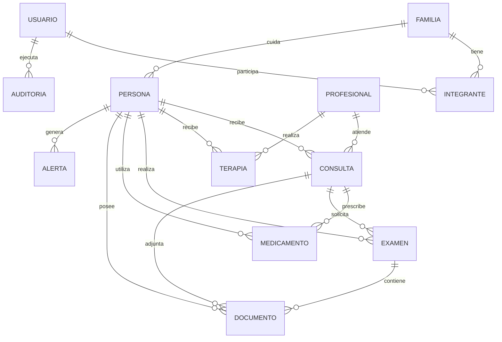
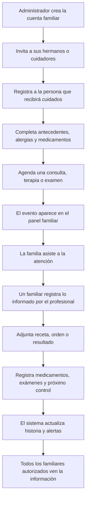
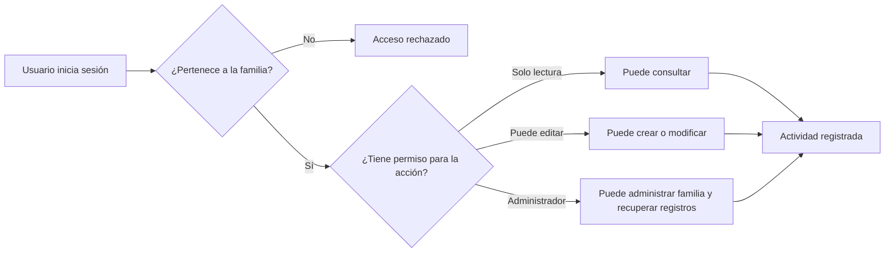
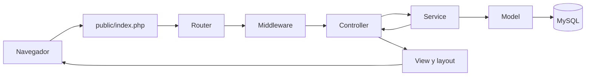

# Propuesta: Portal Familiar de Salud

## 1. Resumen

Se propone crear desde cero un portal privado para que una familia pueda organizar y consultar la información de salud de una o varias personas, por ejemplo, padre, madre u otros familiares dependientes.

El portal permitirá centralizar:

- Historia médica y antecedentes relevantes.
- Horas médicas, terapias y exámenes.
- Medicamentos vigentes y sus horarios.
- Órdenes médicas, recetas, resultados y documentos.
- Información registrada después de cada visita al médico.
- Temas abordados, objetivos y evolución de las terapias.
- Alertas y tareas pendientes dentro del sistema.
- Resúmenes clínicos imprimibles.

El sistema será una herramienta familiar de organización y seguimiento. No reemplazará una ficha clínica oficial ni las indicaciones de un profesional de salud.

## 2. Objetivos

- Mantener toda la información de salud familiar en un lugar único y ordenado.
- Facilitar la coordinación entre hermanos u otros cuidadores.
- Evitar la pérdida de fechas, recetas, órdenes e indicaciones médicas.
- Permitir conocer rápidamente la historia reciente de cada persona.
- Identificar citas, exámenes y medicamentos que requieren atención.
- Registrar quién agregó o modificó información importante.

## 3. Usuarios y permisos

Cada integrante accederá con su propia cuenta Google/Gmail. El portal no administrará contraseñas locales.

### Administrador familiar

- Crear y administrar el grupo familiar.
- Invitar o quitar integrantes.
- Registrar personas dependientes.
- Crear, modificar, recuperar o eliminar registros.
- Asignar permisos de lectura o edición.
- Consultar la bitácora de actividad.

### Familiar

- Consultar la información de las personas autorizadas.
- Ver agenda, medicamentos, documentos e historia clínica familiar.
- Registrar o modificar información cuando tenga permiso de edición.

Una familia podrá gestionar varias personas. Los datos de familias diferentes permanecerán completamente separados.

## 4. Funcionalidades principales

### 4.1 Panel familiar

La pantalla inicial mostrará:

- Selector de persona.
- Próximas consultas, terapias y exámenes.
- Medicamentos activos.
- Documentos recientes.
- Exámenes pendientes.
- Recetas o tratamientos próximos a vencer.
- Controles recomendados aún no agendados.
- Accesos rápidos para registrar una visita, agendar una hora o agregar un medicamento.

### 4.2 Ficha de la persona

Cada persona tendrá una ficha unificada con:

- Nombre, fecha de nacimiento y fotografía opcional.
- Grupo sanguíneo.
- Alergias y enfermedades crónicas.
- Contacto de emergencia.
- Cobertura o previsión de salud, si corresponde.
- Profesionales y centros médicos habituales.
- Medicamentos activos.
- Próximos eventos.
- Documentos recientes.

La ficha tendrá secciones de resumen, historia, agenda, medicamentos, terapias, exámenes y documentos.

### 4.3 Historia y línea de tiempo

La historia reunirá cronológicamente:

- Consultas médicas.
- Sesiones de terapia.
- Exámenes.
- Inicio, modificación y término de medicamentos.
- Antecedentes médicos.
- Recetas, órdenes y resultados.
- Documentos adjuntos.

Se podrá filtrar por persona, período y tipo de información.

### 4.4 Consultas médicas

Cada visita podrá registrar:

- Fecha y hora.
- Especialidad, profesional y centro médico.
- Motivo de consulta.
- Diagnóstico o conclusión informada.
- Indicaciones y recomendaciones.
- Medicamentos recetados.
- Exámenes solicitados.
- Documentos adjuntos.
- Fecha del próximo control.
- Notas familiares posteriores a la consulta.

### 4.5 Agenda familiar

La agenda incluirá:

- Consultas médicas.
- Sesiones de terapia.
- Exámenes y procedimientos.
- Fechas límite para realizar exámenes.
- Controles futuros.

Cada evento tendrá persona, fecha, hora, lugar, profesional, instrucciones previas, observaciones y estado.

Estados disponibles:

- Programado.
- Realizado.
- Cancelado.
- Reprogramado.

La primera versión mostrará recordatorios dentro del portal. No enviará mensajes por correo ni WhatsApp.

### 4.6 Medicamentos

Para cada medicamento se guardará:

- Nombre y presentación.
- Dosis y vía de administración.
- Frecuencia y horarios.
- Fechas de inicio y término.
- Médico que lo indicó.
- Consulta o receta de origen.
- Indicaciones y observaciones.
- Estado: activo, suspendido o finalizado.
- Documentos relacionados.

La primera versión administrará la receta y el horario general. No será obligatorio marcar cada toma individual.

### 4.7 Terapias

Cada sesión podrá registrar:

- Fecha, hora y asistencia.
- Tipo de terapia y profesional.
- Motivo de atención.
- Objetivos terapéuticos.
- Temas abordados.
- Nota libre de la sesión.
- Evolución observada.
- Acuerdos o tareas.
- Fecha de próxima sesión.

De acuerdo con la definición familiar, todos los integrantes autorizados podrán consultar el contenido completo de las sesiones.

### 4.8 Exámenes

Cada examen podrá incluir:

- Tipo de examen.
- Profesional que lo solicitó.
- Fecha de solicitud, realización y vencimiento.
- Centro o laboratorio.
- Instrucciones de preparación.
- Estado: solicitado, agendado, realizado o informado.
- Orden médica y resultado adjunto.
- Resumen del resultado y observaciones.

### 4.9 Documentos

Se podrán almacenar:

- Órdenes médicas.
- Recetas.
- Resultados de exámenes.
- Informes clínicos.
- Certificados.
- Fotografías u otros antecedentes relevantes.

Los archivos serán privados y solo podrán descargarse después de validar la cuenta, la familia y sus permisos.

### 4.10 Reportes

El sistema ofrecerá un resumen imprimible por persona y período, incluyendo:

- Datos esenciales y alertas de salud.
- Antecedentes.
- Medicamentos activos.
- Consultas y terapias.
- Exámenes y resultados.
- Próximos eventos.

Los documentos originales se descargarán por separado.

## 5. Seguridad y privacidad

Debido a la sensibilidad de los datos, se incorporará:

- Inicio de sesión obligatorio.
- Contraseñas almacenadas mediante hash seguro.
- Acceso exclusivo mediante Google, usando OAuth 2.0 y OpenID Connect.
- Sesiones seguras y cierre de sesión.
- Protección contra solicitudes maliciosas mediante tokens CSRF.
- Validación de formularios y archivos.
- Comprobación de permisos en cada consulta y operación.
- Separación estricta entre grupos familiares.
- Archivos médicos fuera del acceso público directo.
- Bitácora con usuario, fecha y tipo de modificación.
- Eliminación lógica y recuperación de registros clínicos.

Antes de incorporar información real, se deberán definir el respaldo de la base de datos, la política de conservación y el lugar seguro donde será alojado el sistema.

## 6. Diseño general

La interfaz estará orientada a usuarios no técnicos y será adaptable a computador y teléfono móvil.

La navegación principal será:

- Inicio.
- Agenda.
- Personas.
- Medicamentos.
- Documentos.
- Configuración familiar.

Ejemplo conceptual del panel:

```text
┌─────────────────────────────────────────────────────────────┐
│ Salud Familiar                         Alertas 🔔  Familia ▼ │
├─────────────────────────────────────────────────────────────┤
│ Inicio │ Agenda │ Personas │ Medicamentos │ Documentos      │
├─────────────────────────────────────────────────────────────┤
│ Persona seleccionada: Juan Pérez ▼                          │
│ 72 años · O+ · Alergia a penicilina                         │
├───────────────────────┬─────────────────────────────────────┤
│ Próximos eventos      │ Medicamentos activos                │
│ 22 Jul · Cardiología  │ Losartán 50 mg · cada 24 horas      │
│ 25 Jul · Examen       │ Metformina 850 mg · cada 12 horas   │
│ 28 Jul · Terapia      │                                     │
├───────────────────────┴─────────────────────────────────────┤
│ Alertas                                                     │
│ Examen de sangre pendiente                                  │
│ Receta de Losartán próxima a vencer                         │
├─────────────────────────────────────────────────────────────┤
│ Historia reciente                                           │
│ 18 Jul · Consulta médica                                    │
│ 12 Jul · Sesión de terapia                                  │
│ 05 Jul · Examen y resultado                                 │
└─────────────────────────────────────────────────────────────┘
```

## 7. Datos del sistema

### 7.1 Información principal

| Módulo | Datos principales |
|---|---|
| Familia | Nombre del grupo, fecha de creación y estado |
| Usuario | Nombre, correo verificado, identificador estable de Google, avatar y estado de la cuenta |
| Integrante | Familia, usuario, rol y permiso de edición |
| Persona atendida | Nombre, nacimiento, identificación opcional, grupo sanguíneo, alergias, enfermedades crónicas y contacto de emergencia |
| Profesional | Nombre, especialidad, teléfono, correo y centro médico |
| Consulta médica | Persona, fecha, profesional, especialidad, motivo, diagnóstico, indicaciones, estado y próximo control |
| Terapia | Persona, fecha, profesional, asistencia, objetivos, temas abordados, evolución, acuerdos y próxima sesión |
| Examen | Persona, tipo, fecha solicitada, fecha agendada, preparación, estado, resultado y observaciones |
| Medicamento | Persona, nombre, presentación, dosis, vía, frecuencia, horarios, período, estado y profesional que lo indicó |
| Documento | Persona, tipo, descripción, fecha, archivo y registro clínico relacionado |
| Alerta | Persona, tipo, fecha de aviso, prioridad, mensaje y estado de lectura |
| Auditoría | Usuario, acción, registro afectado, fecha y descripción del cambio |

### 7.2 Relaciones entre los datos



### 7.3 Ejemplo de información registrada

**Persona:** Juan Pérez, 72 años, grupo sanguíneo O+, alergia a la penicilina e hipertensión.

**Consulta:** control de cardiología el 22 de julio a las 10:30, diagnóstico de hipertensión controlada, continuar tratamiento y realizar examen de sangre.

**Medicamento:** Losartán 50 mg, vía oral, una vez al día a las 09:00, activo desde el 22 de julio.

**Examen:** perfil lipídico, solicitado en la consulta de cardiología, en ayunas y pendiente de agendamiento.

**Alerta:** “El examen de perfil lipídico todavía no tiene fecha”, visible para la familia en el panel.

## 8. Flujo de uso

### 8.1 Flujo principal de la familia



### 8.2 Flujo de una consulta médica

1. Un familiar agenda la consulta indicando persona, profesional, lugar, fecha y motivo.
2. La consulta aparece en la agenda y en las alertas próximas.
3. Después de la visita, el familiar cambia el estado a **realizada**.
4. Registra diagnóstico, indicaciones y observaciones comunicadas por el médico.
5. Adjunta las órdenes, recetas o informes recibidos.
6. Crea desde la consulta los medicamentos y exámenes indicados.
7. Registra la fecha del próximo control, si corresponde.
8. La consulta y todos sus elementos aparecen unidos en la línea de tiempo.

### 8.3 Flujo de un examen

1. El examen se registra manualmente o desde una consulta médica.
2. Inicialmente queda con estado **solicitado**.
3. La familia agrega fecha, centro e instrucciones y pasa a **agendado**.
4. El panel avisa cuando se aproxima la fecha.
5. Después de realizarlo, se marca como **realizado**.
6. Al recibir el informe, se adjunta el archivo, se agrega un resumen y queda **informado**.
7. El resultado aparece en la historia de la persona y enlazado con la consulta original.

### 8.4 Flujo de medicamentos

1. El medicamento se registra desde una receta o directamente desde la ficha.
2. Se define dosis, frecuencia, horarios y fechas del tratamiento.
3. Mientras esté activo, aparece en el resumen de la persona.
4. El panel alerta cuando se acerca la fecha de término.
5. Un familiar puede marcarlo como finalizado o suspendido, conservándolo en la historia.

### 8.5 Flujo de terapia

1. La familia agenda la sesión indicando persona, terapeuta, fecha y tipo de terapia.
2. Después de la sesión se registra asistencia, temas abordados, evolución y acuerdos.
3. Si existe una próxima sesión, se incorpora directamente a la agenda.
4. La sesión queda disponible en la línea de tiempo para todos los familiares autorizados.

### 8.6 Flujo de permisos y seguridad



## 9. Arquitectura técnica propuesta

### 9.1 Tecnologías

La primera versión se construirá con:

- PHP 8.2 o superior, sin depender de Laravel.
- Arquitectura MVC inspirada en las convenciones de Laravel.
- MySQL 8 con claves foráneas, índices y transacciones.
- Composer para carga automática PSR-4 y dependencias puntuales.
- HTML renderizado en el servidor mediante vistas PHP.
- CSS organizado por componentes y JavaScript liviano cuando sea necesario.
- Servidor Apache o Nginx con `public/` como única carpeta pública.

El objetivo es conservar una estructura conocida para desarrolladores Laravel, pero mantener una aplicación pequeña y adecuada al MVP.

### 9.2 Estructura de carpetas

```text
portal-salud/
├── app/
│   ├── Core/
│   │   ├── Application.php
│   │   ├── Config.php
│   │   ├── Container.php
│   │   ├── Database.php
│   │   ├── Router.php
│   │   ├── Request.php
│   │   ├── Response.php
│   │   ├── Session.php
│   │   ├── Validator.php
│   │   └── View.php
│   ├── Http/
│   │   ├── Controllers/
│   │   │   ├── AuthController.php
│   │   │   ├── DashboardController.php
│   │   │   ├── FamiliaController.php
│   │   │   ├── PersonaController.php
│   │   │   ├── AtencionController.php
│   │   │   ├── MedicamentoController.php
│   │   │   ├── DocumentoController.php
│   │   │   └── MantenedorController.php
│   │   └── Middleware/
│   │       ├── Authenticate.php
│   │       ├── AuthorizeFamily.php
│   │       └── VerifyCsrfToken.php
│   ├── Models/
│   │   ├── Familia.php
│   │   ├── Usuario.php
│   │   ├── Persona.php
│   │   ├── Atencion.php
│   │   ├── Medicamento.php
│   │   ├── Documento.php
│   │   ├── Proceso.php
│   │   ├── Estado.php
│   │   └── Tipo.php
│   ├── Services/
│   │   ├── GoogleAuthService.php
│   │   ├── FamiliaService.php
│   │   ├── AtencionService.php
│   │   ├── MedicamentoService.php
│   │   └── DocumentoService.php
│   └── Support/
│       ├── Auth.php
│       ├── Csrf.php
│       └── helpers.php
├── bootstrap/
│   └── app.php
├── config/
│   ├── app.php
│   ├── auth.php
│   ├── database.php
│   └── filesystems.php
├── database/
│   ├── migrations/
│   └── seeders/
├── public/
│   ├── index.php
│   └── assets/
│       ├── css/
│       ├── js/
│       └── images/
├── resources/
│   └── views/
│       ├── layouts/
│       ├── components/
│       ├── auth/
│       ├── dashboard/
│       ├── familias/
│       ├── personas/
│       ├── atenciones/
│       ├── medicamentos/
│       ├── documentos/
│       └── mantenedores/
├── routes/
│   ├── web.php
│   └── auth.php
├── storage/
│   ├── documentos/
│   ├── logs/
│   └── cache/
├── tests/
│   ├── Feature/
│   └── Unit/
├── .env
├── .env.example
├── composer.json
└── README.md
```

### 9.3 Responsabilidad de cada capa

- **Core:** infraestructura común, enrutamiento, base de datos, sesiones, validación y renderizado.
- **Controllers:** reciben la petición, solicitan una operación al servicio y construyen la respuesta.
- **Services:** contienen reglas de negocio y controlan las transacciones.
- **Models:** representan tablas y operaciones de persistencia; no contienen HTML.
- **Middleware:** autentica al usuario, valida CSRF y comprueba acceso a la familia.
- **Views:** presentan datos previamente preparados; no consultan directamente la base de datos.
- **Config:** obtiene configuración desde `.env` sin guardar credenciales en el código.

No se agregará inicialmente una capa de repositorios, porque para este tamaño duplicaría responsabilidades de los modelos. Podrá incorporarse si aparecen varias fuentes de datos o consultas complejas.

### 9.4 Vistas, layouts, componentes y slots

La clase `View` permitirá renderizar vistas PHP con escape de contenido por defecto.

Los layouts principales serán:

```text
resources/views/layouts/
├── app.php       # Portal autenticado
├── guest.php     # Inicio de sesión
└── print.php     # Resúmenes imprimibles
```

Cada página entregará su contenido al `$slot` del layout:

```php
<?= $view->layout('layouts/app', [
    'title' => 'Ficha de la persona',
], function () use ($view, $persona) { ?>
    <h1><?= $view->escape($persona['nombre']) ?></h1>
<?php }) ?>
```

Los componentes reutilizables se guardarán en:

```text
resources/views/components/
├── alert.php
├── badge.php
├── button.php
├── card.php
├── empty-state.php
├── field-error.php
├── form-input.php
├── form-select.php
├── modal.php
├── page-header.php
├── table.php
└── timeline-item.php
```

Los componentes recibirán propiedades y, cuando corresponda, un slot. Las vistas siempre escaparán valores, excepto contenido marcado explícitamente como seguro.

### 9.5 Módulos del MVP

| Módulo | Responsabilidad |
|---|---|
| Autenticación | Iniciar con Google, validar identidad y mantener la sesión local |
| Dashboard | Resumen de personas, próximas atenciones y medicamentos activos |
| Familias | Crear familia y asociar usuarios |
| Personas | Mantener la ficha básica de cada persona cuidada |
| Atenciones | Registrar consulta médica, terapia o examen y su resultado |
| Medicamentos | Mantener tratamientos y horarios |
| Documentos | Cargar y descargar órdenes, recetas, resultados e informes |
| Mantenedores | Administrar procesos, estados y tipos permitidos |

Cada módulo utilizará rutas, controlador, servicio, modelo y carpeta de vistas. Los módulos compartirán el núcleo y los componentes visuales, sin copiar lógica entre ellos.

### 9.6 Rutas

Las rutas se declararán explícitamente y admitirán middleware:

```php
$router->get('/', [DashboardController::class, 'index'])
    ->middleware(['auth']);

$router->resource('/personas', PersonaController::class)
    ->middleware(['auth', 'family']);

$router->resource('/atenciones', AtencionController::class)
    ->middleware(['auth', 'family']);
```

Convenciones principales:

| Método | Ruta | Acción |
|---|---|---|
| GET | `/personas` | Listar |
| GET | `/personas/create` | Mostrar formulario |
| POST | `/personas` | Crear |
| GET | `/personas/{id}` | Consultar |
| GET | `/personas/{id}/edit` | Editar |
| PUT | `/personas/{id}` | Actualizar |
| DELETE | `/personas/{id}` | Eliminar |

La misma convención se aplicará a atenciones, medicamentos y documentos. Los formularios que no puedan enviar `PUT` o `DELETE` utilizarán un campo oculto `_method`.

### 9.7 Flujo de una petición



1. `public/index.php` carga Composer, configuración y contenedor.
2. El router identifica la ruta y sus parámetros.
3. Los middleware validan sesión, CSRF y acceso familiar.
4. El controlador valida la entrada y llama al servicio.
5. El servicio ejecuta reglas de negocio y transacciones.
6. El modelo utiliza consultas preparadas mediante PDO.
7. La vista se inserta en el layout y genera la respuesta HTML.

### 9.8 Base de datos MySQL

La conexión utilizará PDO y configuración proveniente de `.env`:

```text
APP_ENV=local
APP_DEBUG=true
APP_URL=http://localhost:8000

DB_HOST=127.0.0.1
DB_PORT=3306
DB_DATABASE=portal_salud
DB_USERNAME=root
DB_PASSWORD=
```

Reglas de persistencia:

- Motor InnoDB y codificación `utf8mb4`.
- Claves foráneas e índices en todas las relaciones.
- Consultas preparadas para impedir inyección SQL.
- Transacciones para operaciones que modifican varias tablas.
- Fechas técnicas en UTC.
- Credenciales únicamente en `.env`, nunca en el repositorio.
- El esquema inicial seguirá el documento `MODELO_DATOS_BASICO.md`.

### 9.9 Migraciones

Cada cambio del esquema se guardará en un archivo versionado y ejecutable una sola vez:

```text
database/migrations/
├── 001_create_procesos_table.sql
├── 002_create_estados_table.sql
├── 003_create_tipos_table.sql
├── 004_create_familias_table.sql
├── 005_create_usuarios_table.sql
├── 006_create_familia_usuarios_table.sql
├── 007_create_personas_table.sql
├── 008_create_atenciones_table.sql
├── 009_create_medicamentos_table.sql
├── 010_create_medicamento_horarios_table.sql
└── 011_create_documentos_table.sql
```

La tabla `migrations` guardará nombre y fecha de ejecución. Un comando `php console migrate` aplicará únicamente las migraciones pendientes. Para el entorno local se podrá usar `php console migrate:fresh --seed`, con advertencia porque elimina y reconstruye la base de datos.

Las migraciones de producción no modificarán archivos anteriores ya aplicados; cada ajuste generará una nueva migración.

### 9.10 Seeders

Los seeders crearán únicamente catálogos y datos de demostración controlados:

```text
database/seeders/
├── DatabaseSeeder.php
├── ProcesosSeeder.php
├── EstadosSeeder.php
├── TiposSeeder.php
└── DemoSeeder.php
```

- `ProcesosSeeder`: miembro familiar, atención, medicamento y documento.
- `EstadosSeeder`: estados permitidos por proceso.
- `TiposSeeder`: roles, tipos de atención y tipos de documento.
- `DemoSeeder`: familia y registros ficticios, solo en desarrollo.

Los seeders usarán código como identificador estable y serán idempotentes: ejecutarlos nuevamente no deberá duplicar filas.

### 9.11 Archivos y almacenamiento

- `public/` será la única raíz expuesta por el servidor web.
- Los documentos médicos se guardarán en `storage/documentos/{familia_id}/{persona_id}/` con un nombre aleatorio.
- La base de datos conservará nombre original, ruta, tipo MIME y fecha.
- Las descargas pasarán por `DocumentoController`, que comprobará autenticación y pertenencia familiar antes de transmitir el archivo.
- Se limitarán tamaño, extensiones y tipos MIME aceptados.
- Los logs no incluirán notas clínicas, contraseñas ni contenido de documentos.

### 9.12 Seguridad mínima

- Validación de `state`, `nonce`, firma, emisor, audiencia y vencimiento del ID token de Google.
- Identificación estable del usuario mediante el claim `sub`.
- Regeneración del identificador de sesión al iniciar sesión.
- Cookies `HttpOnly`, `SameSite=Lax` y `Secure` en producción.
- Token CSRF en formularios que modifiquen información.
- Escape HTML en vistas.
- Validación del lado servidor.
- Autorización por familia en cada registro, no solo en la interfaz.
- Mensajes de error genéricos para el acceso y detalles técnicos solamente en logs.

### 9.13 Pruebas

```text
tests/
├── Feature/
│   ├── AuthTest.php
│   ├── FamilyAccessTest.php
│   ├── PersonaTest.php
│   ├── AtencionTest.php
│   ├── MedicamentoTest.php
│   └── DocumentoTest.php
└── Unit/
    ├── ValidatorTest.php
    └── EstadoTipoTest.php
```

Las pruebas funcionales verificarán rutas completas y aislamiento entre familias. Las unitarias comprobarán validación y selección de estados y tipos por proceso.

## 10. Etapas propuestas

### Etapa 1: seguridad y estructura familiar

- Acceso con cuentas Google/Gmail y asociación con la familia.
- Grupos familiares, invitaciones y permisos.
- Protección de rutas, registros y documentos.
- Creación de la base de datos inicial.

### Etapa 2: ficha e historia unificada

- Ficha completa por persona.
- Línea de tiempo clínica.
- Formularios mejorados con selectores por nombre.
- Búsqueda y filtros.

### Etapa 3: agenda y seguimiento

- Calendario familiar.
- Consultas, terapias y exámenes.
- Medicamentos y horarios.
- Alertas internas.

### Etapa 4: documentos y reportes

- Carga y descarga privada de archivos.
- Resumen imprimible.
- Bitácora y recuperación de registros.
- Ajustes para dispositivos móviles.

## 11. Criterios de aceptación

- Cada integrante ingresa con su propia cuenta.
- Un administrador puede invitar familiares y asignar permisos.
- Una familia puede gestionar varias personas sin mezclar sus datos.
- Ningún usuario puede acceder a información de otra familia.
- Consultas, terapias, exámenes y medicamentos aparecen correctamente en la historia.
- Consultas, terapias y exámenes programados aparecen en la agenda.
- El panel identifica próximos eventos y asuntos pendientes.
- Los documentos solo se descargan con una sesión y permisos válidos.
- Las modificaciones importantes quedan registradas en la bitácora.
- Los registros eliminados pueden recuperarse administrativamente.
- El resumen clínico puede imprimirse de forma clara.
- Las funciones principales son utilizables desde computador y teléfono.

## 12. Supuestos adoptados

- Una familia puede administrar varias personas.
- Existirán administradores y familiares con permisos configurables.
- Todos los familiares autorizados podrán ver las notas completas de terapia.
- Los avisos estarán solamente dentro del portal durante la primera versión.
- Se guardarán recetas y horarios, pero no el cumplimiento de cada toma.
- No se expondrá una API pública en esta etapa.
- El sistema se desarrollará en PHP puro, con arquitectura MVC y MySQL.
